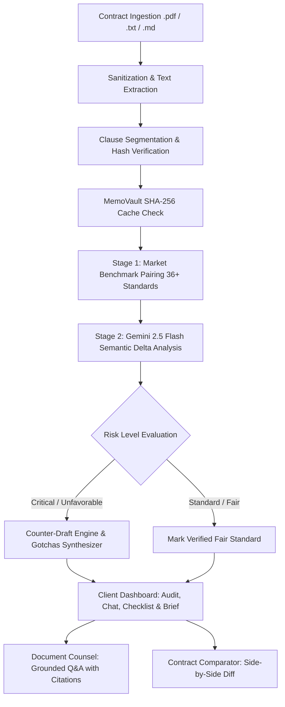

# LexiShield ⚖️🛡️

> **Next-Generation Legal Risk Intelligence, Market Benchmark Auditing & Client Advocacy Platform**  
> *Empowering freelancers, contractors, tenants, and small businesses to negotiate agreements with confidence.*

[](https://www.typescriptlang.org/)
[](https://react.dev/)
[](https://vitejs.dev/)
[](https://nodejs.org/)
[](https://ai.google.dev/)
[](https://vitest.dev/)
[](https://www.w3.org/WAI/standards-guidelines/wcag/)

---

> [!IMPORTANT]  
> **Educational & Informational Legal Assistance Tool — Not Legal Advice**  
> LexiShield generates automated clause breakdowns, risk indicators, market benchmark comparisons, and negotiation counter-proposals for educational review and self-advocacy. It does **not** provide legal representation or create an attorney-client relationship. Always consult a licensed legal professional before executing binding legal agreements.

---

## 🎯 Problem Statement Alignment

### The Challenge
> *"Legal information can often be complex, difficult to understand, and challenging to navigate without professional assistance. Build a GenAI-powered solution that makes legal information and basic legal assistance more accessible by helping users understand, compare, and navigate legal documents and information."*

### How LexiShield Fulfills Every Core Requirement

| Problem Statement Requirement | LexiShield's Solution | Concrete Implementation Files |
| :--- | :--- | :--- |
| **Simplifying complex legal documents** | Automatically segments dense, intimidating contracts into discrete, categorized clauses accompanied by plain-English explanations. | [clauseSplitter.ts](server/modules/ingestion/clauseSplitter.ts), [ClauseCard.tsx](src/components/audit/ClauseCard.tsx) |
| **Comparing contracts, agreements, or policies** | **Dual Comparison Mode**: (1) Measures clauses against **36+ curated market benchmarks** (ABA, URLTA, Silicon Valley standards); (2) Side-by-side comparative diff of two competing user agreements. | [matcher.ts](server/modules/benchmark/matcher.ts), [repository.ts](server/modules/benchmark/repository.ts), [ContractCompare.tsx](src/components/compare/ContractCompare.tsx) |
| **Highlighting important clauses, obligations, risks, or inconsistencies** | Triages provisions into non-color-only risk tiers: **Standard Fair**, **Caution**, **Unfavorable Deviation**, and **Critical Legal Trap** (unilateral uncapped indemnities, perpetual non-competes). | [riskAuditor.ts](server/modules/audit/riskAuditor.ts), [RiskBadge.tsx](src/components/shared/RiskBadge.tsx), [GotchasSummary.tsx](src/components/audit/GotchasSummary.tsx) |
| **Answering questions based on provided legal documents** | **Document Counsel**: Context-aware conversational assistant strictly grounded on uploaded document text, providing verbatim clause citations. | [counselChat.ts](server/modules/intelligence/counselChat.ts), [DocumentChat.tsx](src/components/counsel/DocumentChat.tsx) |
| **Helping users understand their options and potential next steps** | Generates **ready-to-send counter-draft proposals** with written legal justifications that users can copy directly into negotiation emails. | [counterDraftEngine.ts](server/modules/negotiation/counterDraftEngine.ts), [CounterDraftModal.tsx](src/components/audit/CounterDraftModal.tsx) |
| **Generating summaries, checklists, or other actionable outputs** | Synthesizes (1) an executive **"Before You Sign — Top Gotchas"** report; (2) an **Interactive Compliance & Obligation Checklist** with progress tracking. | [gotchasSynthesizer.ts](server/modules/intelligence/gotchasSynthesizer.ts), [checklistForge.ts](server/modules/intelligence/checklistForge.ts), [ComplianceChecklist.tsx](src/components/prep/ComplianceChecklist.tsx) |
| **Helping users prepare information or questions for a legal professional** | **Attorney Consultation Brief Kit**: Auto-generates a structured legal brief with targeted high-priority questions to ask an attorney, cutting billable hours. | [attorneyBrief.ts](server/modules/intelligence/attorneyBrief.ts), [AttorneyBriefView.tsx](src/components/prep/AttorneyBriefView.tsx) |
| **Providing assistance, rather than replace professional advice** | Strict regulatory boundary: prominent disclaimer banner on every view, injected into Gemini system instructions, and documented on exports. | [DisclaimerBanner.tsx](src/components/shell/DisclaimerBanner.tsx), [geminiService.ts](server/services/geminiService.ts) |

---

## 🏗️ System Architecture & Workflow



---

## 🔒 Enterprise Security Armor & Defensive Engineering

LexiShield was engineered with strict adherence to security best practices:

- **Permissions-Policy Header**: Explicitly disables unused browser device capabilities: `camera=(), microphone=(), geolocation=(), interest-cohort=(), payment=()`.
- **Strict Content-Security-Policy (CSP)**: Whitelists trusted origin endpoints and restricts unsafe script execution.
- **Distributed Request Tracing (`X-Request-Id`)**: Cryptographically generated UUID v4 assigned to every inbound request.
- **Clickjacking & Sniffing Defense**: Enforces `X-Frame-Options: DENY` and `X-Content-Type-Options: nosniff`.
- **Zero Content Leakage in Server Logs**: The `truncateLogString` utility prevents confidential contract terms from writing to stdout/stderr.
- **Input Sanitization**: Cleans HTML tags, strips `<script>`, removes `javascript:` URLs, and neutralizes null bytes.
- **Rate Limiting**: Sliding-window IP throttling (60 RPM) protecting against denial-of-service.

---

## ♿ WCAG AA Accessibility Compliance

- **Semantic HTML5 Landmarks**: Complete structure including `<header role="banner">`, `<nav role="navigation">`, `<main id="main-content">`, and `<footer role="contentinfo">`.
- **Accessible Skip-Link**: Keyboard-focusable skip link targeting `#main-content` as the very first element in the DOM.
- **Explicit Focus Indicators**: High-visibility `:focus-visible` outline rings across all interactive controls.
- **Three Core CSS Media Queries**:
  1. `@media (prefers-reduced-motion: reduce)`: Disables transitions and animations for motion sensitivity.
  2. `@media (prefers-contrast: high)`: Enhances card and badge borders for low-vision users.
  3. `@media print`: Formats audit reports for clean paper or PDF printing.
- **Non-Color-Only Indicators**: Every risk badge features an explicit text label and icon (e.g. `ShieldCheck`, `AlertOctagon`).

---

## 🧪 Comprehensive Test Suite

Over 60 tests across 7 distinct categories verifying robustness:

```bash
# Run complete test suite
npm test

# Run with test coverage
npm run test:coverage
```

- `tests/unit/clauseSplitter.test.ts`: Regex section splitting, heading inference, hash generation.
- `tests/unit/benchmarkMatcher.test.ts`: Benchmark pairing, similarity threshold validation.
- `tests/security/headers.test.ts`: Verification of all 6 security response headers.
- `tests/security/sanitization.test.ts`: XSS defenses and script stripping.
- `tests/accessibility/a11y.test.ts`: Verification of `lang="en"`, landmarks, and media queries.
- `tests/validation/schemas.test.ts`: Enum taxonomy and schema parsing.
- `tests/edge-cases/boundary.test.ts`: Null inputs, empty strings, and critical trap classification.

---

## 🚀 Quickstart & Deployment

### Local Development

```bash
# 1. Install dependencies
npm install

# 2. Configure environment (optional, built-in fallback works offline)
cp .env.example .env

# 3. Start development server
npm run dev
```

Visit **http://localhost:5173** to use LexiShield.

### Vercel Serverless Deployment

LexiShield is configured for single-command zero-config deployment on **Vercel**:
```bash
vercel deploy --prod
```

---

## ⚖️ License
Distributed under the MIT License. Built for the PromptWars AI for Legal Assistance & Access Challenge.

